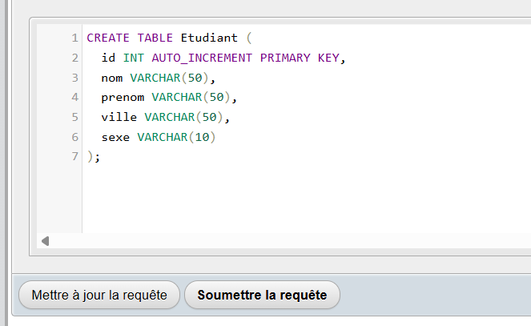
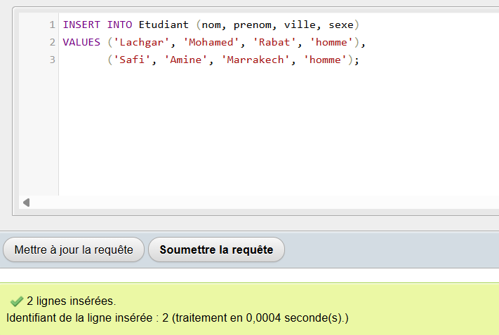
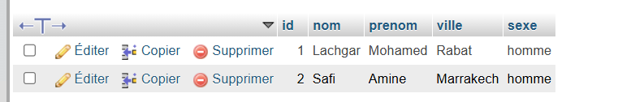
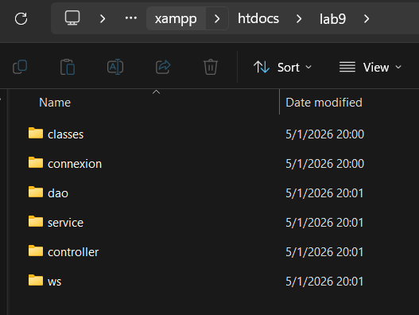
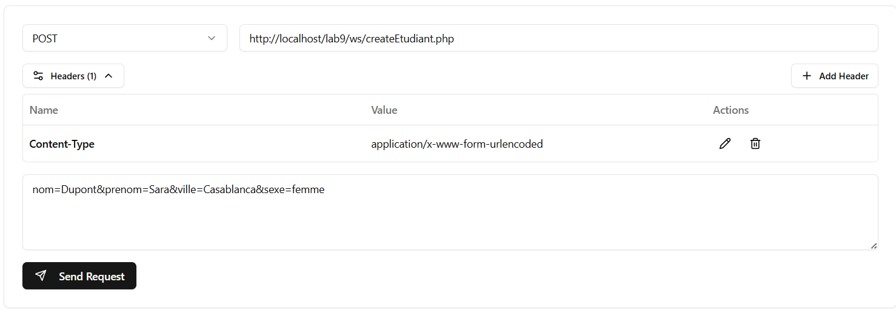
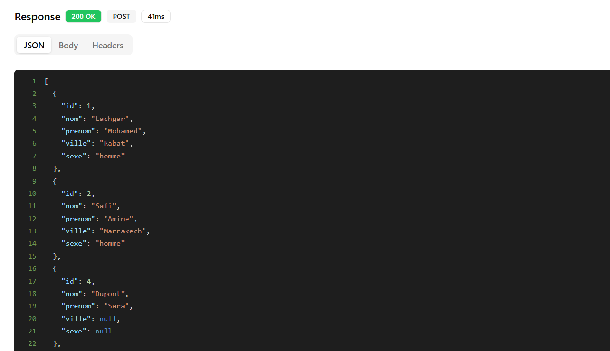
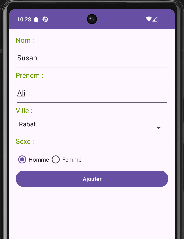
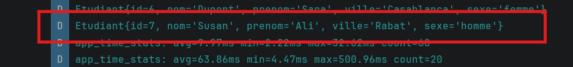

# Projet de Gestion d'Étudiants - Android Lab 9

Ce projet illustre la mise en place d'un système complet permettant d'ajouter et de consulter des étudiants via une application mobile Android communiquant avec un serveur local MySQL à travers des Web Services PHP.

## Fonctionnalités

*   **Persistance de données** : Stockage des informations (nom, prénom, ville, sexe) dans une base de données MySQL.
*   **Architecture Web Service** : API RESTful en PHP utilisant PDO pour la sécurité des transactions.
*   **Test d'API** : Validation des services web avec Advanced REST Client avant intégration.
*   **Application Mobile Android** : 
    *   Interface utilisateur moderne utilisant des Styles et Layouts personnalisés.
    *   Gestion du réseau avec la bibliothèque **Volley**.
    *   Désérialisation automatique du format JSON en objets Java grâce à **Gson**.
*   **Sécurité** : Configuration du trafic en clair pour permettre les tests sur un serveur local.

---

## 📸 Organisation et Explication des Résultats

### 1. Base de Données (MySQL)
La structure de la table est essentielle pour correspondre aux objets manipulés par l'API et l'application Android.

Création de la table `Etudiant` avec un identifiant auto-incrémenté:

Insertion manuelle de données de test via phpMyAdmin:

Aperçu de la table remplie avec les premiers enregistrements:

### 2. Structure du Web Service (PHP)
Le projet suit une organisation rigoureuse en dossiers (`dao`, `service`, `ws`) pour séparer la logique métier de l'accès aux données.

### 3. Tests de l'API 
Avant d'utiliser Android, nous validons que le PHP renvoie correctement les données demandées.

Simulation d'une requête **POST** pour ajouter un nouvel étudiant:

Réponse du serveur au format **JSON** affichant la liste mise à jour des étudiants:

### 4. Application Android en Action
L'application finale permet à l'utilisateur de saisir des données et de voir le résultat instantanément dans les logs de développement.

Interface de l'application sur l'émulateur:

Logcat d'Android Studio montrant la réception réussie de l'objet `Etudiant` après ajout:

Ce README est maintenant prêt à être ajouté à la racine de ton projet Git ou rendu pour ton laboratoire ! Tout te semble correct ?
